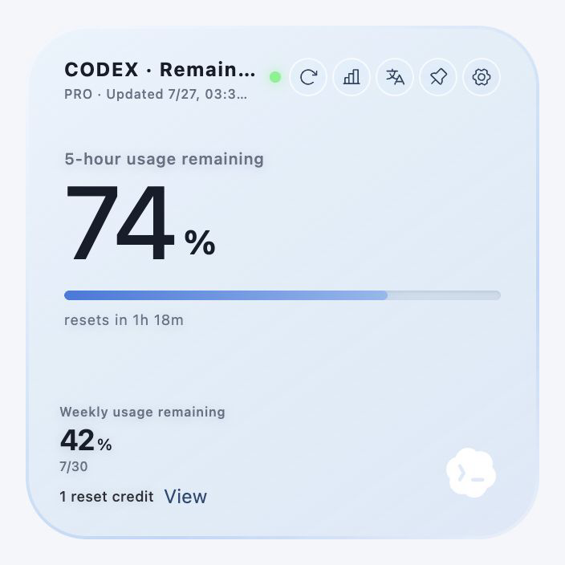
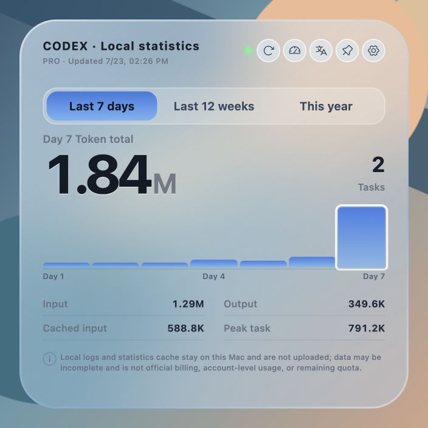
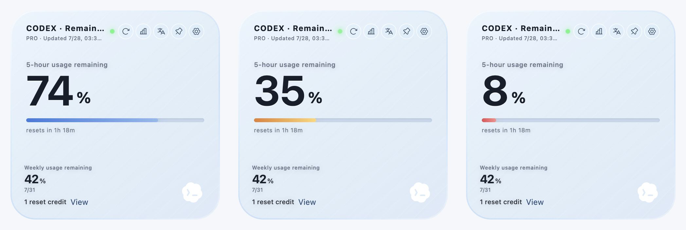
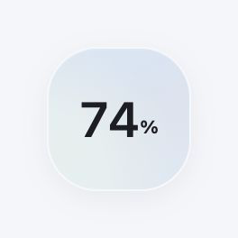
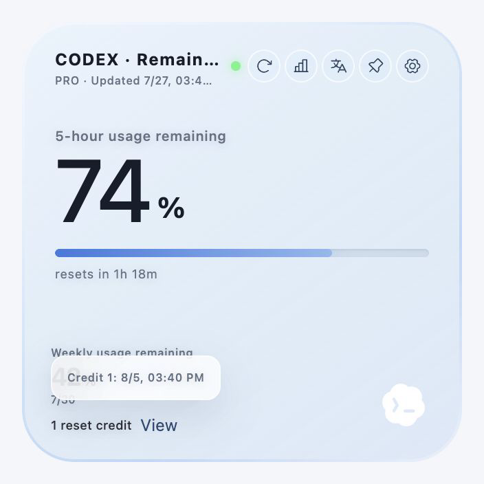

# TokenHalo

**Codex Usage Monitor**

Lightweight floating desktop widget for checking Codex quota from the local Codex Desktop login state.

TokenHalo is an independent open-source project. It is not affiliated with, endorsed by, or sponsored by OpenAI. Codex is referenced only to describe compatibility.

| Remaining quota | Local Token statistics |
| --- | --- |
|  |  |

Screenshots use simulated data. Installed desktop builds read the current user's own Codex quota and local session records when available.

## Highlights

- Shows the usage windows returned for the signed-in Codex plan, including five-hour or weekly remaining usage when provided, plus reset timing and reset-credit information.
- Switches between remaining quota and local Token statistics from the same expanded card.
- Summarizes the last 7 natural days, the last 12 ISO weeks starting on Monday, or January through December of the current year.
- Uses clear quota states for healthy, caution, and critical remaining usage.
- Collapses into a small floating orb when idle, then expands on hover.
- Uses a 100×100 orb, a 320×320 quota card, and a 400×400 statistics card while preserving the nearest screen-edge anchor.
- Indicates whether quota is currently being consumed.
- Includes quick controls for language switching and always-on-top behavior.
- Lets macOS users adjust glass transparency, Clear/Regular style, and Weak/Medium/Strong effect strength.
- Shows reset credit count and available reset-credit expiration times when the Codex usage service provides them.
- Handles stale data, signed-out sessions, unavailable quota responses, and loading states without fabricating values.

## Screenshots

### Quota states



| Floating orb | Reset credit expiration |
| --- | --- |
|  |  |

## Repository Metadata

Suggested repository description:

```text
TokenHalo is a floating Windows/macOS desktop widget for checking Codex quota from the local Codex Desktop login state.
```

Suggested topics:

```text
tokenhalo, codex, quota, tauri, react, rust, desktop-app, windows, macos, productivity
```

## How It Works

The remaining-quota page reads the existing Codex Desktop login state on your machine and queries Codex/ChatGPT quota endpoints with that session. It does not infer remaining quota from local Token counts, redeem reset credits, or modify account settings.

The statistics page independently parses Token-count records from the current user's `~/.codex/sessions`. It does not require a developer-specific path or manual log import. A desktop build installed from GitHub Releases therefore reads the installing user's own local session directory, when it exists and is readable.

The three statistics tabs use these definitions:

- **Last 7 days:** the last 7 consecutive natural days, with one bar per day and today at the right.
- **Last 12 weeks:** the last 12 ISO weeks, with one Monday-to-Sunday week per bar and the current week at the right.
- **This year:** January through December of the current natural year, with one bar per month and future months retained as zero-value positions.

The browser preview uses mock data. Real quota reading and local statistics require the Tauri desktop app.

## macOS Glass Support

- macOS 26 and newer first attempt card-scoped native Liquid Glass.
- Older supported macOS versions use card-scoped native Vibrancy.
- If native glass cannot be applied, the card keeps a readable translucent CSS fallback.

The same saved transparency, style, and effect-strength preferences drive these paths, but native rendering can differ slightly by macOS version. Native glass is inserted behind the WebView only within the orb or card frame, so the transparent window area outside the rounded card remains clear. This release is distributed outside the Mac App Store. Supporting an App Store sandbox build, including its filesystem-access model and review requirements, is outside the scope of this release.

## Download

The repository workflow is configured to publish unsigned installers from version tags:

- Latest release: https://github.com/BitPan666/TokenHalo/releases/latest
- Windows: use the `.exe` or `.msi` installer.
- macOS Universal: use the `.dmg` bundle.

Check the release notes to confirm that the downloaded version includes local Token statistics. A local branch or successful local build is not itself a published GitHub release.

These installers are not platform-code-signed or notarized, so Windows SmartScreen or macOS Gatekeeper may block or warn on first launch. On macOS, open the `.dmg`, drag TokenHalo to Applications, then right-click TokenHalo and choose **Open**. If it is still blocked, allow it in **System Settings → Privacy & Security**. Signing and notarization can be added later to remove most of this first-launch friction.

## Feedback

Please use GitHub Issues for bugs, compatibility reports, and feature requests:

https://github.com/BitPan666/TokenHalo/issues

## Privacy Boundary

TokenHalo is local-first and intentionally narrow:

- Reads the local Codex Desktop login state only to query remaining quota.
- Reads Token-count records from the current user's `~/.codex/sessions` for the local statistics page.
- Sends the existing Codex access token only to ChatGPT quota endpoints.
- Stores widget preferences and a local numeric statistics index in its own app config directory.
- Stores relative session identifiers, file fingerprints/cursors, numeric parser state, and aggregate totals in that index.
- Does not store Codex tokens, account IDs, prompts, replies, code, raw session lines, raw quota responses, or absolute session-root paths.
- Does not upload raw session text or the local statistics index.
- Does not include telemetry, analytics, crash reporting, or third-party tracking.
- Does not redeem reset credits or modify account settings.

See [PRIVACY.md](PRIVACY.md) and [SECURITY.md](SECURITY.md) for the full boundary.

## Accuracy Boundary

Remaining quota is read from Codex usage service responses. If the response format changes, the app shows an unavailable or stale state instead of inventing quota values.

Local Token statistics may omit cloud, other-device, deleted, unreadable, or format-changed records. They are trend estimates only, not official billing, account-wide usage, or remaining quota. See [docs/KNOWN-LIMITATIONS.md](docs/KNOWN-LIMITATIONS.md) for operational details.

## Development

Requirements:

- Node.js 20+
- Rust stable
- Tauri 2 system dependencies for your platform

```bash
npm install
npm run dev
npm run test
npm run build
npm run tauri dev
```

## Build

```bash
npm run tauri build
```

On Windows, Tauri may download WiX to create an MSI installer. If WiX download fails, the release executable may still be produced at:

```text
src-tauri/target/release/tokenhalo.exe
```

## Release

GitHub Actions are configured for:

- CI on push/PR: frontend tests, Rust tests, web build, Tauri build.
- `v*` tags: unsigned Windows installers, a macOS Universal `.dmg`, and a public GitHub Release.

See [docs/GITHUB-RELEASE-CHECKLIST.md](docs/GITHUB-RELEASE-CHECKLIST.md) before publishing a version for others.

Do not upload local credentials, `.codex`, `.env*`, screenshots with personal data, `node_modules`, `dist`, `src-tauri/target`, or local installers to source control.

## License

MIT
